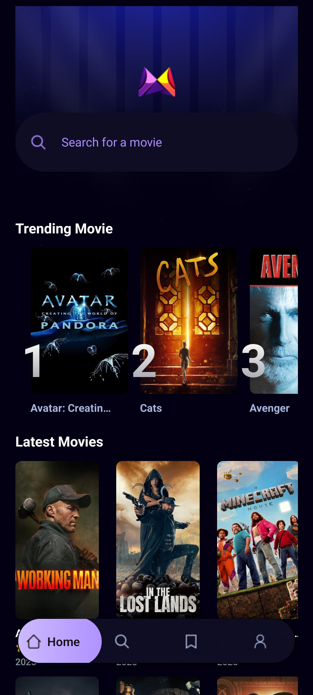
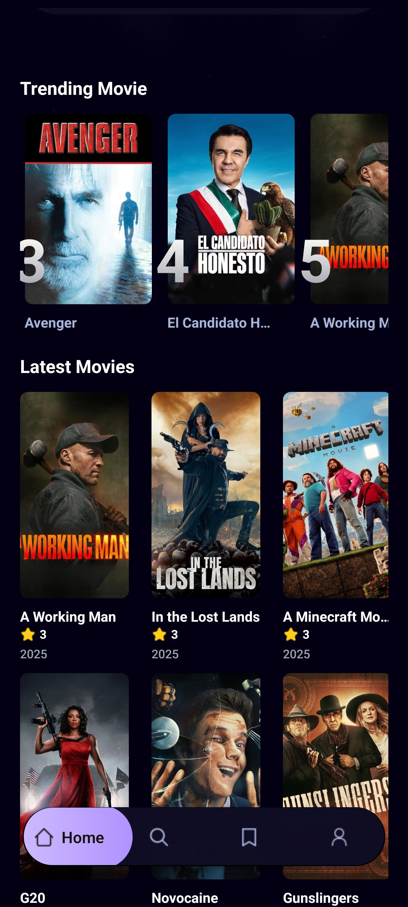
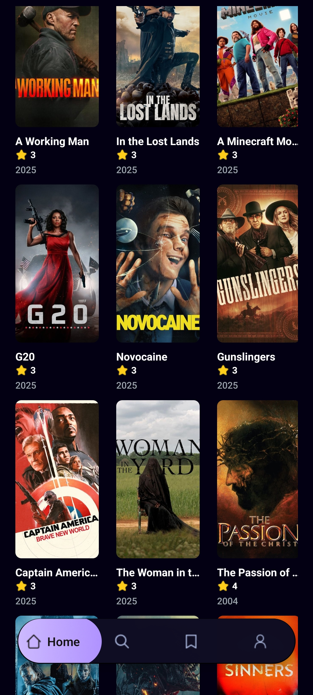
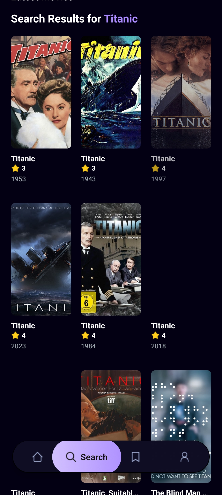
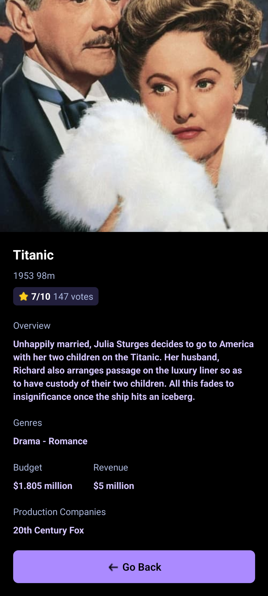
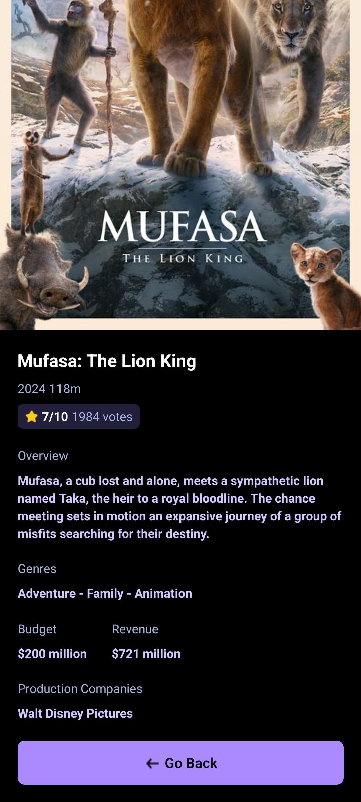
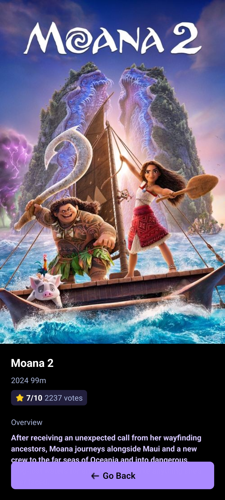

# Netflix Clone

This project is a Netflix Clone that features a home page displaying trending and latest movies, a search functionality to find movies, and a backend powered by Appwrite. The movie data is fetched using the TMDB API.

## Features

<div style="display: flex; flex-wrap: wrap; gap: 10px; justify-content: center;">
   
   
   
   
</div>
<div style="display: flex; flex-wrap: wrap; gap: 10px; justify-content: center; margin-top: 20px;">
   
   
   
   
</div>

- **Home Page**: Displays trending and latest movies.
- **Search Functionality**: Allows users to search for movies by title.
- **Backend**: Built using [Appwrite](https://appwrite.io/).
- **Movie Data**: Fetched from [TMDB API](https://www.themoviedb.org/documentation/api).

## Tech Stack

- **Frontend**: React (or specify your frontend framework/library if different)
- **Backend**: Appwrite
- **API**: TMDB API

## Installation

1. Clone the repository:

   ```bash
   git clone https://github.com/your-username/netflix-clone.git
   cd netflix-clone
   ```
2. Install dependencies:

   ```bash
   npm install
   ```
3. Set up environment variables:

   - Create a `.env` file in the root directory.
   - Add your TMDB API key and Appwrite configuration:
     ```env
     EXPO_PUBLIC_API_KEY_READ_ACCESS_TOKEN=tmdb read token
     EXPO_PUBLIC_TMDB_API_KEY= tmdb api key
     EXPO_PUBLIC_APPWRITE_KEY= app write key
     EXPO_PUBLIC_APPWRITE_ENDPOINT= app write endpoint
     EXPO_PUBLIC_APPWRITE_DATABASE_ID= app write database id
     EXPO_PUBLIC_APPWRITE_COLLECTION_ID= app write collection id
     ```
4. Start the development server:

   ```bash
   npm start
   ```

## Usage

- Visit the home page to view trending and latest movies.
- Use the search bar to find specific movies.
- The backend handles user data and other server-side operations using Appwrite.

## Acknowledgments

- [TMDB API](https://www.themoviedb.org/documentation/api) for providing movie data.
- [Appwrite](https://appwrite.io/) for backend services.

## License

This project is licensed under the [MIT License](LICENSE).
